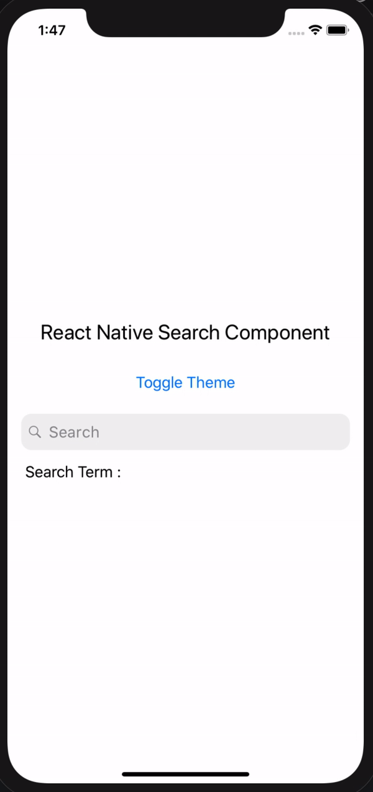
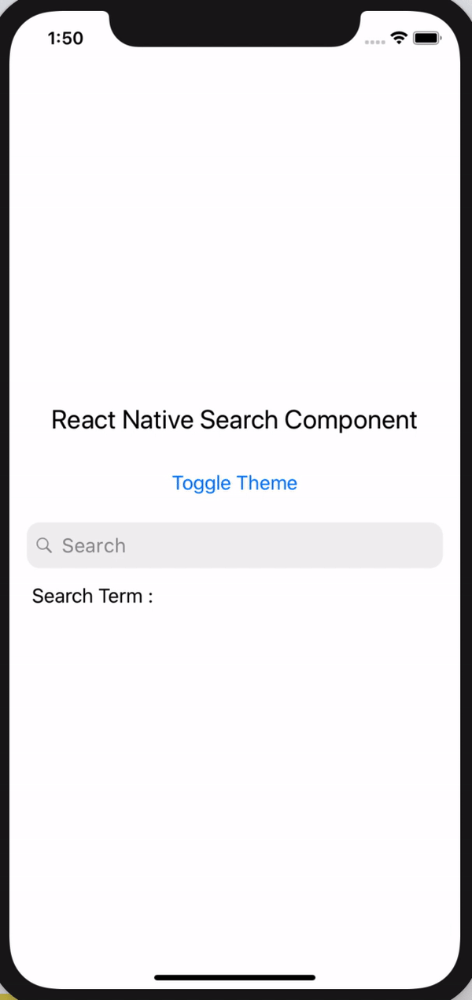
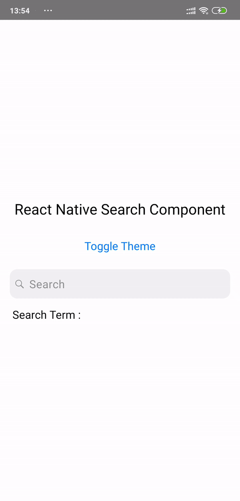
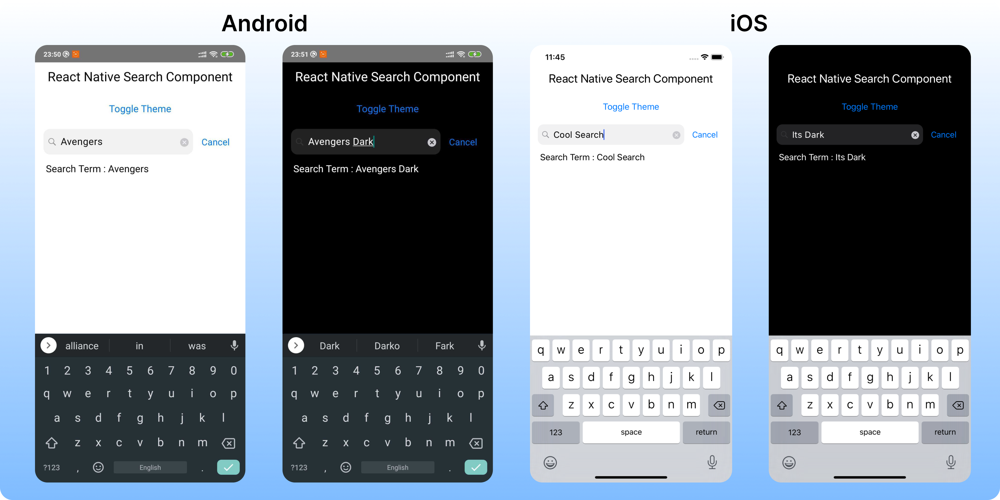

<div align='center'>
  
  
  [](https://www.npmjs.com/package/react-native-search-component)
  [](https://www.npmjs.com/package/react-native-search-component)

  <h1>React Native Search Component</h1>
  
  

  

  
  
</div>

## :anchor: Installation

```sh

yarn add react-native-search-component
# or
npm i react-native-search-component

```

## :family: Dependencies

##### React Native Reanimated

```sh
npm install react-native-reanimated
```

For iOS

```sh

cd ios && pod install && cd ..

```

For Android

1. Turn on Hermes engine by editing android/app/build.gradle

```code

project.ext.react = [
  enableHermes: true  // <- here | clean and rebuild if changing
]

```

2. Plug Reanimated in MainApplication.java

```code
  import com.facebook.react.bridge.JSIModulePackage; // <- add
  import com.swmansion.reanimated.ReanimatedJSIModulePackage; // <- add
  ...
  private final ReactNativeHost mReactNativeHost = new ReactNativeHost(this) {
  ...

      @Override
      protected String getJSMainModuleName() {
        return "index";
      }

      @Override
      protected JSIModulePackage getJSIModulePackage() {
        return new ReanimatedJSIModulePackage(); // <- add
      }
    };
  ...
```

> For detailed instructions check it out [here](https://docs.swmansion.com/react-native-reanimated/docs/next/installation)

##### React Native SVG

```sh

npm install react-native-svg

```

For iOS

```sh
cd ios && pod install && cd ..
```

> For detailed instructions check it out [here](https://github.com/react-native-community/react-native-svg)

> Rebuild the project after adding the dependencies

## :mag: Usage

```js
import React, { useState } from "react";
import { SafeAreaView, StyleSheet, Text, TouchableOpacity } from "react-native";
import SearchComponent from "react-native-search-component";

const App = () => {
  const [theme, setTheme] = React.useState("LIGHT");
  const [searchTerm, setSearchTerm] = useState("");

  const toggleTheme = () =>
    theme === "LIGHT" ? setTheme("DARK") : setTheme("LIGHT");
  const themeBasedContainer = [
    styles.container,
    { backgroundColor: theme === "LIGHT" ? "white" : "black" },
  ];
  const themeBasedTextStyle = [
    styles.textStyle,
    { color: theme === "LIGHT" ? "black" : "white" },
  ];

  const onChange = (e) => {
    setSearchTerm(e?.nativeEvent?.text);
  };
  const onSearchClear = () => setSearchTerm("");

  return (
    <SafeAreaView style={themeBasedContainer}>
      <Text style={themeBasedTextStyle}>React Native Search Component</Text>
      <TouchableOpacity style={{ paddingVertical: 12 }} onPress={toggleTheme}>
        <Text style={[styles.textStyle, { color: "#007AFF", fontSize: 18 }]}>
          Toggle Theme
        </Text>
      </TouchableOpacity>
      <SearchComponent
        value={searchTerm}
        theme={theme}
        onChange={onChange}
        onSearchClear={onSearchClear}
      />
      <Text
        style={[
          themeBasedTextStyle,
          { textAlign: "left", paddingLeft: 16, fontSize: 18 },
        ]}
      >
        {" "}
        Search Term : {searchTerm}
      </Text>
    </SafeAreaView>
  );
};

const styles = StyleSheet.create({
  container: {
    flex: 1,
    justifyContent: "center",
  },
  textStyle: {
    fontSize: 24,
    textAlign: "center",
    paddingVertical: 10,
  },
});

export default App;
```

## :camera: Screenshot

<div>
  

  
</div>

## :wrench: Props

| Name                   | Description                                                | Required | Type                 | Default        |
| --------------------   | ------------------------------------------------           | -------- | -------------------- | -------------- |
| value                  | A search term Value                                        | Yes      | String               | ''             |
| placeholder            | A placeholder value                                        | No       | String               | ''             |
| placeholderTextColor   | Tintcolor for Placeholder                                  | No       | Color                | Based on theme |
| onChange               | A Callback function returning TextInput onChange           | Yes      | Function             | () => {}       |
| onSearchClear          | A Callback function on Close Icon click                    | No       | Function             | () => {}       |
| theme                  | App Theme                                                  | NO       | oneOf['LIGHT','DARK] | 'LIGHT'        |
| isLoading              | Loading state Indicator on search                          | NO       | Boolean              | false          |
| loadingTintColor       | The tint color of spinner                                  | NO       | Color                | '#636366'      |
| cancelColor            | The tint color of 'Cancel' text                            | NO       | Color                | '#007AFF'      |
| customSearchInputStyle | The styles, that will rewrite default searchInputStyle     | NO       | Object               | [Check here](https://github.com/timelessco/react-native-search-component#wrench-style-objects)       |
| customCancelTextStyle  | The styles, that will rewrite default "cancel" text Style  | NO       | Object               |   [Check here](https://github.com/timelessco/react-native-search-component#wrench-style-objects)               |

## :wrench: Style Objects

```
default value of Custome Search Input
{
  fontSize: 18,
  fontWeight: '400',
  lineHeight: 22,
  letterSpacing: 0.5,
  paddingHorizontal: 12,
  paddingVertical: 10,
  borderRadius: 12,
  paddingLeft: 32
}

default value of Custom Cancel Text Style
{
  paddingLeft: 16,
  fontSize: 17,
  color: props.cancelColor
}
```

## :wrench: Methods

```
.searchInputRef()
```
Returns searchTextInput ref. Useful for directly control search input.

Example:
```js
import { useEffect, useRef } from 'react';

[...]

const searchInput = useRef();

[...]

const toggleFocus = () => {
  const isFocused = searchInput.current.searchInputRef().isFocused();
  if (isFocused) {
    searchInput.current.searchInputRef().blur();
  } else {
    searchInput.current.searchInputRef().focus();
  }
};

<SearchComponent
  value={searchTerm}
  theme={theme}
  onChange={onChange}
  onSearchClear={onSearchClear}
  ref={searchInput}
/>
```

## :tada: Example

Checkout the example [here](https://github.com/timelessco/react-native-search-component/tree/master/example/RNSearch).

## :notebook: Blog

Checkout my blog [here](https://medium.com/timeless/react-native-search-component-de0be89df6e1).

## :snowman: Built with ❤️ and

- [react-native](https://www.npmjs.com/package/react-native)
- [react-native-reanimated](https://docs.swmansion.com/react-native-reanimated/)
- [react-native-svg](https://github.com/react-native-community/react-native-svg)

## :v: Contributing

Pull requests are always welcome! Feel free to open a new GitHub issue for any changes that can be made.

## :man: Author

[Karthik B](https://twitter.com/_iam_karthik)

## :clipboard: License

MIT

<div align="center">
<sub><sup>Project by <a href="https://github.com/timelessco"> @Timeless</a></sup></sub><small> ✌</small>
</div>
